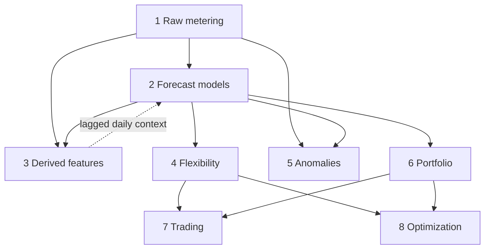

# Forecasting System Architecture

## Core Layers

1. **Raw metering** — Raw data (30-min intervals, kWh)
2. **Forecast models** — Point & distribution forecasts (yhat, P10, P50, P90)
3. **Derived features** — Daily energy, peak, ramp, profiles
4. **Flexibility** — Available reduction/increase, SOC projections
5. **Anomalies** — Residuals, outliers, asset health
6. **Portfolio** — Aggregated forecasts, correlation effects
7. **Trading** — Confidence-adjusted volume, tradable quantity
8. **Optimization** — Stochastic planning, scenario trees

The numbering labels the layers; it does not prescribe a build order or a strict
pipeline. Layers are composable and can be explored independently and out of order.

Two relationships the numbering hides:

- **Derived features feed back into forecasting** (dashed). Daily metrics are computed
  from raw metering, then joined back onto the 30-min series as model inputs
  (`metering_data_with_features.parquet`). Lagging is required to avoid leakage.
- **Anomalies need two layers at once.** Residuals are raw minus forecast, so layer 5
  depends on layers 1 and 2 jointly, not on either alone.

## Design Principles

- **Separation of concerns**: each layer is independent and composable
- **Reusable intermediates**: forecasts feed downstream layers as intermediate products
- **Standard contracts**: consistent data schema across layers
- **Swappable models**: SeasonalNaive baseline, SARIMA, ExponentialSmoothing, LightGBM — interchangeable behind the layer-2 contract
- **Transparent flow**: data moves through layers in clear progression

## Key Decisions

**Why 15 assets with 2 types:**
- Large enough to test clustering & model selection
- Two distinct patterns: predictable (EV) vs variable (solar)
- Realistic energy use cases
- Foundation for portfolio analysis

**Why 2-week window (14 days):**
- Captures full weeks (includes weekday/weekend patterns)
- Small enough for quick iteration
- Sufficient for seasonal/weekly features
