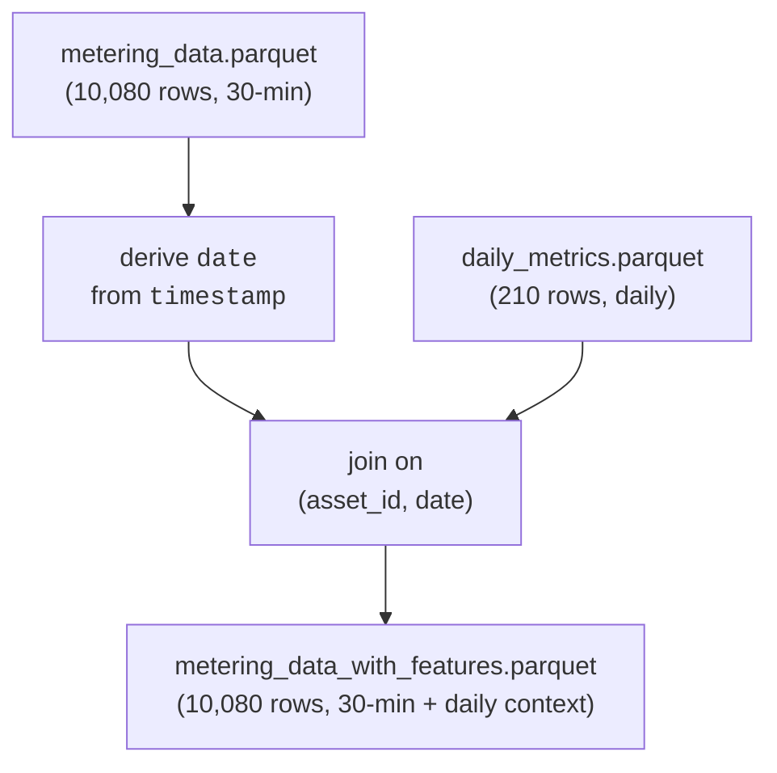

# Feature Engineering

This document describes how daily behavioral metrics are joined back onto the 30-minute
metering series to produce a single model-ready table.

**Source:** `src/data/generate_metering_features.py`

See [Data Generation and Calculations](data_generation.md) for how `metering_data.parquet`
and `daily_metrics.parquet` are produced upstream of this step.

## Motivation

Forecasting models operating at 30-minute resolution benefit from context that is only
observable at the daily level: how variable an asset's load was yesterday, how peaky
it typically runs, how often it sits at zero. `daily_metrics.parquet` already computes
these per asset-day, but at 210 rows it cannot be joined directly into a 30-minute model
matrix — each daily row needs to be repeated across the 48 half-hour intervals it covers.

## Join Logic

Each of the 210 asset-day rows in `daily_metrics.parquet` is broadcast across the 48
half-hour rows of `metering_data.parquet` that share its `asset_id` and `date` — every
row within a given asset-day carries the same daily feature values.

## Column Naming

All columns joined in from `daily_metrics.parquet` (other than the `asset_id`/`date` join
keys, which are dropped after the join) are prefixed with `feat_`, e.g. `daily_energy_kwh`
becomes `feat_daily_energy_kwh`. This keeps daily-context columns visually distinct from
columns native to the 30-minute series (`metering_kwh`, `asset_type`), so a model or
analysis reading the schema can immediately tell which features vary within a day and
which are constant across it.

## Output Data

### metering_data_with_features.parquet

**Schema:** every column from `metering_data.parquet` (see its schema in
[Data Generation and Calculations](data_generation.md#metering_dataparquet-raw-time-series)),
plus every column from `daily_metrics.parquet` renamed with a `feat_` prefix — same
fields and meanings as documented in that page's
[daily_metrics.parquet schema](data_generation.md#daily_metricsparquet-daily-aggregates--behavioral-features),
just repeated per 30-min row instead of per asset-day:

| daily_metrics.parquet column | becomes |
|---|---|
| `daily_energy_kwh` ... `peak_to_avg_ratio` (all 12 metric columns) | `feat_daily_energy_kwh` ... `feat_peak_to_avg_ratio` |

**Size:** 10,080 rows (same as `metering_data.parquet`) — every row has a matching
daily row, so no nulls are introduced by the join.

**Usage:**
- Model matrix for 30-minute forecasting models that want same-day behavioral context
  as a feature (note: for a real forecast this should be the *previous* day's metrics,
  lagged by one day, to avoid leaking same-day information — see Caveats below)
- Quick way to slice/filter 30-min rows by daily behavior (e.g. "only high-CV days")

## Caveats

`feat_*` columns currently describe the **same day** as the row's timestamp. For live
forecasting this is look-ahead leakage — the model would be conditioning on daily totals
it could not know until the day is over. This table is intended as a general-purpose,
easy-to-inspect join of daily context onto the 30-minute series; a forecasting pipeline
should shift `date` by one day (or otherwise lag the join) before using these columns as
model inputs.
