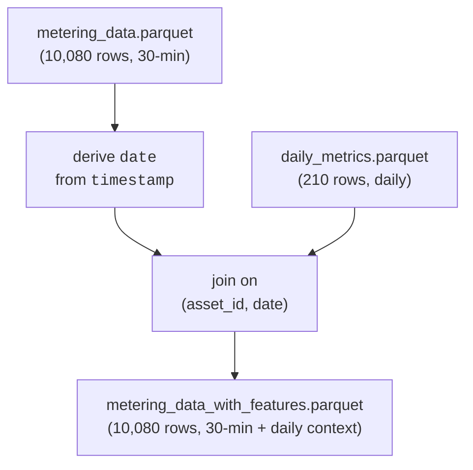

# Feature engineering

This document describes how daily behavioral metrics are joined back onto the 30-minute
metering series to produce a single model-ready table.

**Source:** `src/data/generate_metering_features.py`

See [Data Generation and Calculations](data_generation.md) for how `metering_data.parquet`
and `daily_metrics.parquet` are produced upstream of this step.

## Motivation

Forecasting models operating at 30-minute resolution benefit from context that is only
observable at the daily level: how variable an asset's load was yesterday, how peaky
it typically runs, how often it sits at zero. `daily_metrics.parquet` already computes
these per asset-day, but at 210 rows it cannot be joined directly into a 30-minute model
matrix — each daily row needs to be repeated across the 48 half-hour intervals it covers.

## Join logic



Each of the 210 asset-day rows in `daily_metrics.parquet` is broadcast across the 48
half-hour rows of `metering_data.parquet` that share its `asset_id` and `date` — every
row within a given asset-day carries the same daily feature values.

## Column naming

All columns joined in from `daily_metrics.parquet` (other than the `asset_id`/`date` join
keys, which are dropped after the join) are prefixed with `feat_`, e.g. `daily_energy_kwh`
becomes `feat_daily_energy_kwh`. This keeps daily-context columns visually distinct from
columns native to the 30-minute series (`metering_kwh`, `asset_type`), so a model or
analysis reading the schema can immediately tell which features vary within a day and
which are constant across it.

## Output data

### metering_data_with_features.parquet

**Schema:** every column from `metering_data.parquet` (see its schema in
[Data Generation and Calculations](data_generation.md#metering_dataparquet-raw-time-series)),
plus every column from `daily_metrics.parquet` renamed with a `feat_` prefix — same
fields and meanings as documented in that page's
[daily_metrics.parquet schema](data_generation.md#daily_metricsparquet-daily-aggregates-and-behavioral-features),
just repeated per 30-min row instead of per asset-day:

| daily_metrics.parquet column | becomes |
|---|---|
| `daily_energy_kwh` ... `peak_to_avg_ratio` (all 12 metric columns) | `feat_daily_energy_kwh` ... `feat_peak_to_avg_ratio` |

**Size:** 10,080 rows (same as `metering_data.parquet`) — every row has a matching
daily row, so no nulls are introduced by the join.

**Usage:**
- Model matrix for 30-minute forecasting models that want same-day behavioral context
  as a feature (note: for a real forecast this should be the *previous* day's metrics,
  lagged by one day, to avoid leaking same-day information — see Caveats below)
- Quick way to slice/filter 30-min rows by daily behavior (e.g. "only high-CV days")

## Caveats

`feat_*` columns currently describe the **same day** as the row's timestamp. For live
forecasting this is look-ahead leakage — the model would be conditioning on daily totals
it could not know until the day is over. This table is intended as a general-purpose,
easy-to-inspect join of daily context onto the 30-minute series; a forecasting pipeline
should shift `date` by one day (or otherwise lag the join) before using these columns as
model inputs.

A one-day lag is only sufficient for a horizon of h ≤ 48 (one day ahead). For a longer
forecast — say four days — days 2 to 4 of the horizon have no observed daily metrics
available at forecast time, so those features would themselves have to be forecast, or held
fixed at the forecast-origin day's values. Decide which before extending the horizon.

See [Feature validation](feature_validation.md) for how to check a model-ready table for
this kind of leakage before training on it, and [Feature selection](feature_selection.md)
for narrowing down which `feat_*` columns a model should actually use.

## Lag and rolling features

!!! warning "Proposed — not implemented"
    `generate_metering_features.py` does not currently produce lag or rolling-window
    columns; this section records the intended approach for when it does.

| Feature type | Input | Primary benefit | Polars |
|---|---|---|---|
| Lagged values | individual past points | preserves step-by-step signal and seasonality | `pl.col("metering_kwh").shift(k)` |
| Rolling statistics | aggregate over a past window | smooths noise, captures trend/range | `pl.col("metering_kwh").rolling_mean(w)` |

To add lag features without look-ahead leakage:

1. **Shift forward in time, not back.** A lag-$k$ feature at time $t$ must hold the value
   from $t-k$, never $t$ or later — `shift(k)` on a series sorted by `timestamp` within each
   `asset_id`.
2. **Drop the leading nulls the shift introduces.** The first $k$ rows of each asset have no
   prior observation to draw from; drop them rather than filling with a future or synthetic
   value, which would itself be leakage.
3. **Split chronologically before scaling or training** — see [Feature
   validation](feature_validation.md#chronological-splitting).

```python
import polars as pl

def add_lag_features(df: pl.DataFrame, col: str, max_lag: int) -> pl.DataFrame:
    return df.with_columns(
        [pl.col(col).shift(k).over("asset_id").alias(f"{col}_lag{k}") for k in range(1, max_lag + 1)]
    ).drop_nulls([f"{col}_lag{k}" for k in range(1, max_lag + 1)])

featured = add_lag_features(metering_df, "metering_kwh", max_lag=4)  # 2 hours of prior lags
```

## Temporal encoding

!!! warning "Proposed — not implemented"
    Hour-of-day is currently used as a plain integer feature in `LightGBMModel`'s default
    feature set (see [Models](../theory/models.md#lightgbm-gradient-boosting)); sin/cos
    encoding is not yet applied anywhere in the pipeline.

Integer hour-of-day (0-23) encodes midnight and 23:00 as maximally far apart, when they are
one 30-minute step apart on a cyclical day. Sin/cos encoding fixes this by mapping the hour
onto a circle:

$$\sin\left(\frac{2\pi \cdot h}{24}\right), \quad \cos\left(\frac{2\pi \cdot h}{24}\right)$$

This matters most for linear models and neural networks, which read the integer as an
ordered magnitude. Tree models like LightGBM split on thresholds rather than magnitude, so
the benefit is smaller, but Fourier terms can still help it model smooth, overlapping
multi-seasonal patterns — daily and weekly cycles together, for instance — more directly
than raw calendar integers. See [the weekly-cycle
gap](../theory/models.md#the-weekly-cycle-no-default-configuration-captures) for why this
project's current feature set has no day-of-week signal at all.
