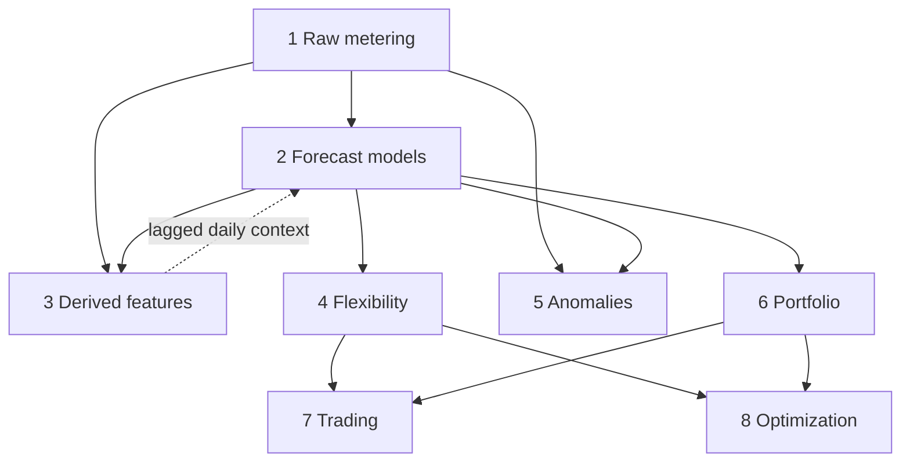

# Architecture

The forecasting system is organised into layers. Each layer takes a defined input,
produces a defined output, and can be worked on independently — a model in layer 2 can be
swapped without touching anything downstream, and the derived signals in layer 3+ do not
care which model produced the forecast.

!!! note "What exists today"
    Layers 1-2 are built (`src/data/` and `src/ts_model_framework.py`). Everything from
    layer 3 up is design — see [Forecast products](forecast_products.md). This page
    describes the intended shape; it does not add or change any code.

## The layers

| # | Layer | Input | Output |
|---|---|---|---|
| 1 | Raw metering | — | 30-min metering series per asset (kWh per interval) |
| 2 | Forecast models | one asset's history | point forecast + interval (`ForecastOutput`) |
| 3 | Derived features | a forecast series | daily energy, peak, ramp, expected schedule |
| 4 | Flexibility | forecast + interval | available reduction/increase, SOC projections |
| 5 | Anomalies | raw metering **and** forecast | standardised residuals, asset-health flags |
| 6 | Portfolio | per-asset forecasts | aggregated forecast, error-correlation effects, reconciliation |
| 7 | Trading | flexibility + portfolio | confidence-adjusted tradable volume |
| 8 | Optimization | flexibility + portfolio | scenario trees, stochastic plans |

The numbering labels the layers; it does not prescribe a build order. Layers are
composable and can be explored out of order.

Two relationships the table hides:

- **Derived features feed back into forecasting** (dashed edge). Daily metrics are computed
  from raw metering, then joined back onto the 30-min series as model inputs
  (`metering_data_with_features.parquet`). The join must be lagged to avoid leakage — see
  [Feature engineering](../data/feature_engineering.md#caveats).
- **Anomaly detection needs two layers at once.** A residual is raw metering minus forecast,
  so layer 5 depends on layers 1 and 2 jointly.

## The forecast contract

Layer 2 is the boundary every downstream layer builds on, so its output is fixed:

- **In-memory** — `ForecastOutput` (`prediction`, `lower`, `upper`, `uncertainty_width`) and
  `EvaluationMetrics` (`mape` and `pi_coverage` are percentages, 0-100). See
  [Framework usage](../coding/framework_usage.md#output-contracts).
- **Persisted / cross-layer** (target shape) — `asset_id`, `timestamp`, `prediction`,
  `uncertainty`, `model_version`.

Downstream layers consume `expected`, `conservative`, and `uncertainty` as three separate
numbers rather than a single collapsed value — this is what lets layer 4 or 8 decide how
much uncertainty to absorb rather than baking that choice into the forecast. See
[Forecast products](forecast_products.md#uncertainty-as-a-decision-input).

## Design principles

- **Separation of concerns** — each layer is independent and composable.
- **Reusable intermediates** — a forecast feeds many downstream layers, computed once.
- **Standard contracts** — a consistent schema at each layer boundary.
- **Swappable models** — SARIMA, Exponential Smoothing, LightGBM and the seasonal-naive
  baseline are interchangeable behind the layer-2 contract.
- **Transparent flow** — data moves through layers in a clear progression.
