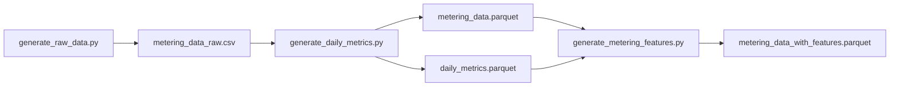

# Data Generation and Inspection

The generation scripts moved to `src/data/` (promoted to production code, since
their output is a production data contract). This folder now holds notes only.

See [main_idea.md](../main_idea.md) for system architecture.

**Detailed documentation:** [docs_src/data/](../../docs_src/data/)
- [Synthetic Metering Data Description](../../docs_src/data/synthetic_metering_data.md) — asset types, patterns, behavioral metrics
- [Data Generation and Calculations](../../docs_src/data/data_generation.md) — generation process, formulas, schema

---

## Quick Start

```bash
cd src/data

python generate_raw_data.py
# Creates: metering_data_raw.csv (10,080 rows)

python generate_daily_metrics.py
# Creates: metering_data.parquet, daily_metrics.parquet

python generate_metering_features.py
# Creates: metering_data_with_features.parquet
```

---

## Scripts (in `src/data/`)

### `generate_raw_data.py`

Creates synthetic metering data: 15 assets, 14 days, 30-minute intervals.

**Output:** `metering_data_raw.csv`
```
asset_id, timestamp, metering_kwh, asset_type
```

**Parameters:**
- Seed: 42 (reproducible)
- Assets: 8 EV charging + 7 solar+battery

### `generate_daily_metrics.py`

Analyzes raw data and computes daily metrics.

**Outputs:**
- `metering_data.parquet` — Raw time series (10,080 rows)
- `daily_metrics.parquet` — Daily aggregates + behavioral features (210 rows)

**Computed metrics:**
- Energy: daily_energy_kwh, daily_peak_kw, daily_min_kw, daily_avg_kw, daily_std_kw
- Ramps: mean_ramp_kw, std_ramp_kw, max_abs_ramp_kw
- Behavior: coefficient_of_variation, intermittency_ratio, peak_to_avg_ratio

### `generate_metering_features.py`

Joins `daily_metrics.parquet` onto `metering_data.parquet`, broadcasting each
asset-day's daily features across that day's 48 half-hour rows. Joined columns
are prefixed with `feat_` to distinguish them from native 30-min columns.

**Output:** `metering_data_with_features.parquet` — 30-min series + daily context (10,080 rows)

---

## Data Pipeline



---

## Output Files

See [Data Generation and Calculations](../../docs_src/data/data_generation.md#output-data) for detailed schema.

| File | Rows | Purpose |
|------|------|---------|
| metering_data.parquet | 10,080 | 30-min time series for forecasting |
| daily_metrics.parquet | 210 | Daily aggregates + behavioral metrics |
| metering_data_with_features.parquet | 10,080 | 30-min series with daily features broadcast per day |

---

## Key Features

- **Reproducible:** Seed=42, identical data across runs
- **Consolidated:** All daily analysis in single daily_metrics table
- **Behavioral:** Daily CV, intermittency, peak-to-avg ratio enable adaptive models
- **Operationally useful:** Ramp rates inform flexibility constraints
